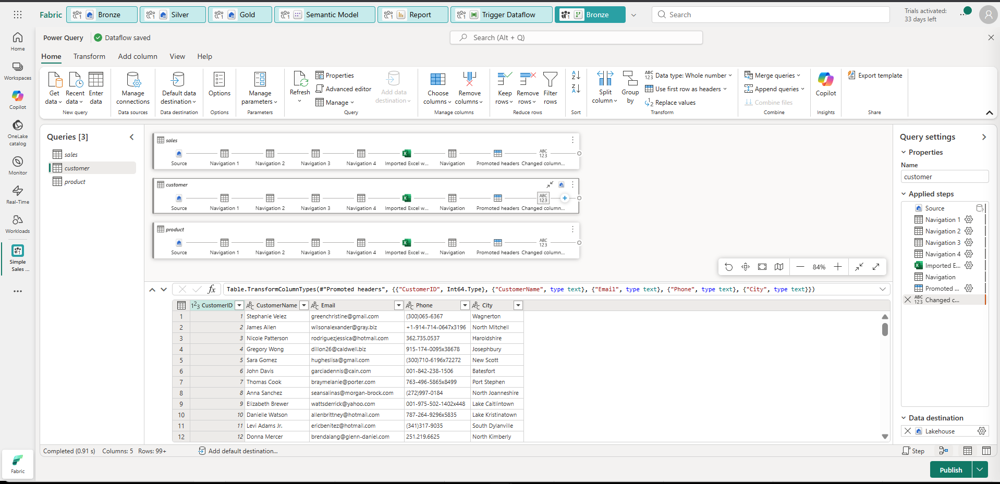
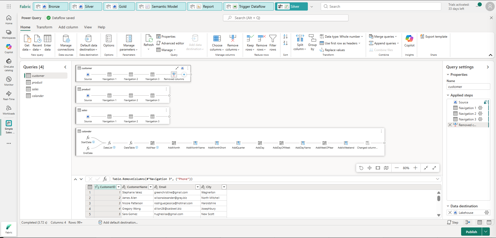
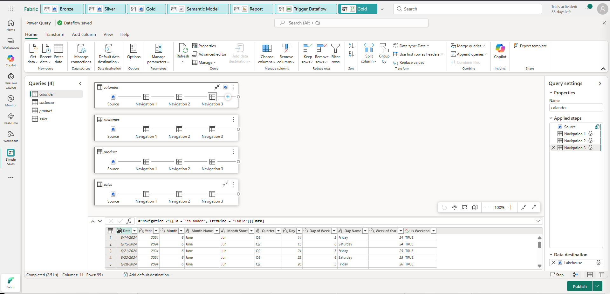

# Microsoft Fabric Sales Medallion Architecture Project

## Project Overview
This project demonstrates an end-to-end data analytics pipeline built using Microsoft Fabric. The solution follows the Medallion Architecture (Bronze, Silver, Gold) to transform raw sales data into structured and analytics-ready datasets used for reporting and insights.

---

## Architecture

Data Source → Bronze Layer → Silver Layer → Gold Layer → Semantic Model → Power BI Dashboard

---

## Data Processing Architecture (Medallion Architecture)

This project follows the **Medallion Architecture (Bronze → Silver → Gold)** to transform raw sales data into analytics-ready datasets. Each layer improves data quality and prepares the data for business analysis.

---

## Bronze Layer – Raw Data Ingestion

In the **Bronze layer**, raw data is ingested from source files into the Lakehouse without major transformations.

Datasets used in this project:

- Sales
- Customer
- Product

Using **Dataflow Gen2**, the raw files are imported and basic transformations are applied such as:

- Loading source files
- Navigating datasets
- Promoting headers
- Changing column data types

This layer acts as the **raw data storage layer**, preserving the original dataset.

---

## Silver Layer – Data Cleaning and Transformation

In the **Silver layer**, the raw data is cleaned and structured to improve data quality.

Transformations performed include:

- Removing unnecessary columns
- Standardizing column formats
- Cleaning and organizing datasets
- Preparing structured datasets for analytics

This layer ensures the data becomes **clean, consistent, and ready for further analysis**.

---

## Gold Layer – Analytics Ready Data

The **Gold layer** contains curated datasets used for reporting and analytics.

Key processes include:

- Creating a **Calendar table** for time-based analysis
- Preparing business-ready datasets
- Structuring data relationships

This layer provides **high-quality datasets optimized for dashboards and reporting**.

---

## Dashboard Overview

The curated data is connected to **Power BI dashboards** through the **Semantic Model** to generate business insights.

### Sales Overview Page
Displays key business metrics such as:

- Total Sales
- Revenue trends
- Sales distribution over time

### Product Performance Page
Provides insights into:

- Top-selling products
- Product-wise revenue
- Category-based sales performance

### Customer Insights Page
Analyzes:

- Customer distribution by region
- Revenue contribution by customers
- Market segmentation

---

## End-to-End Data Flow

Raw Data → Bronze Layer → Silver Layer → Gold Layer → Semantic Model → Power BI Dashboard

---

## Technologies Used

- Microsoft Fabric  
- Dataflow Gen2  
- Lakehouse  
- SQL Endpoint  
- Power BI  
- DAX  

---

## Author

**Shivratna Kedar**
